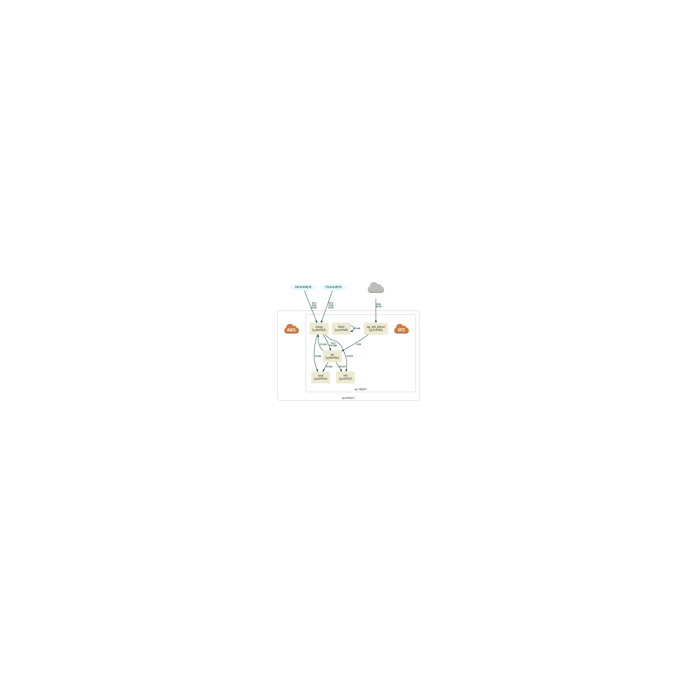

# Sgviz

A visualization tool for AWS VPC Security Groups.

## Installation

Add this line to your application's Gemfile:

```ruby
gem 'sgviz'
```

And then execute:

```bash
$ bundle
```

Or install it yourself as:

```bash
$ gem install sgviz
```

## Usage

```bash
$ sgviz generate --output-path myvpc --region ap-northeast-1 --vpc-ids vpc-146fad71
```

will generate



If you using OSX, run `$ sgviz open` to view the graph instantly.

Run `$ sgviz help` to view more usage.

## TODO, Known Bugs

* Bug: Problem with outbound edges (duplicate with inbound?).
* TODO: Internal IP address nodes.
* TODO: VPC Peerings.
* TODO: Add spec. (No test code now. Sorry.)
* TODO: Integrate EC2/ELB/RDS/ElastiCache/Redshift components in graph.
* etc...

## Contributing

1. Fork it ( https://github.com/[my-github-username]/sgviz/fork )
2. Create your feature branch (`git checkout -b my-new-feature`)
3. Commit your changes (`git commit -am 'Add some feature'`)
4. Push to the branch (`git push origin my-new-feature`)
5. Create a new Pull Request
